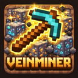

<p align="center">
  
</p>

<h1 align="center">Old VeinMiner</h1>

<p align="center">
  <b>Chain-mine entire ore veins with a single block break.</b><br>
  A VeinMiner mod for Minecraft 1.4.7 + Forge.
</p>

<p align="center">
  <a href="https://minecraft.net/"></a>
  <a href="https://minecraftforge.net/"></a>
  <a href="https://openjdk.org/"></a>
  <a href="LICENSE"></a>
  <a href="https://github.com/Vany/ovm/releases"></a>
  <a href="https://github.com/Vany/ovm/releases"></a>
</p>

---

## How It Works

Hold the **activation key** (`` ` `` by default) and break a block. All connected blocks of the same type are chain-mined in a single operation. Drops go straight to your inventory.

- **26-directional flood fill** with distance-priority (closest blocks first)
- Works with **ores, leaves (shears), and any connected blocks**
- **Redstone ore** variants (lit/unlit) treated as the same vein
- Tool durability consumed per block, mining stops if tool breaks
- Hunger cost proportional to blocks mined

## Install

1. Install [Minecraft Forge 1.4.7](https://files.minecraftforge.net/net/minecraftforge/forge/index_1.4.7.html)
2. Download `ovm-*.jar` from [Releases](https://github.com/Vany/ovm/releases)
3. Drop it into your `mods/` folder
4. Launch the game

## Configuration

Edit `config/ovm.cfg` after first launch:

| Option | Default | Description |
|--------|---------|-------------|
| `maxBlocks` | `64` | Maximum blocks mined per vein operation |
| `hungerPerBlocks` | `32` | Blocks mined per 1 hunger point (0 = free) |
| `dropsToInventory` | `true` | Deliver drops to inventory (overflow at feet) |
| `activationKey` | `41` | LWJGL keycode (41 = grave/backtick `` ` ``) |

## Building from Source

Requires Docker (amd64 emulation on Apple Silicon).

```bash
# Build the Docker image (first time only, ~15 min)
docker build -t veinminer-dev .

# Compile and package
bash scripts/build.sh
```

Output: `ovm-<version>.jar` in the repo root, auto-deployed to `1.4.7/minecraft/mods/` if present.

## Architecture

```
src/com/ovm/
  OvmMod.java          # Forge mod entry point, tick handler
  OvmClientHandler.java # Client: key polling, break detection, packet sending
  OvmPacketHandler.java # Server: packet reception, dynamic proxy
  VeinMiner.java        # Server: flood fill, block breaking, drop collection
  McAccessor.java       # Cached reflection accessors for Minecraft objects
  Reflect.java          # Reflection utilities for obfuscated member access
  OvmConfig.java        # Forge configuration
```

All Minecraft members accessed via **dual-name reflection** (MCP + obfuscated), since FML's RelaunchClassLoader does not remap mod code at runtime.

## License

[MIT](LICENSE)
